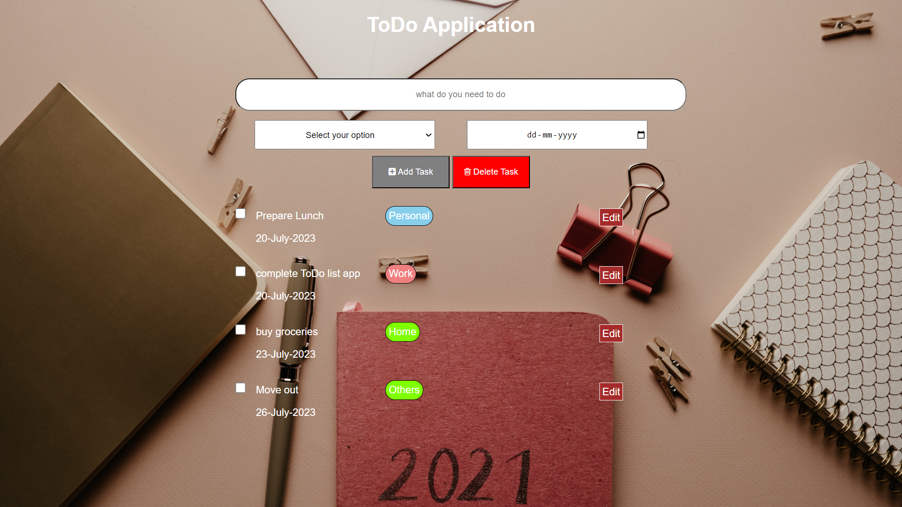

# To-Do-List-app

This project is a ToDo list application 
build using backend technology(Node.js, Express.js and MongoDB as database and ejs as templating engine to view the application).

This application is based on CRUD functionality where a user can easily create, read, update and delete items.

<h2>What I learned</h2>

I learned about the role of MVC (Model, View and Controller) in a server side technology.And how a CRUD application works.

